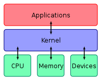

나는 내 노트북에 Ubuntu 18.04를 듀얼부팅해서 쓴다. 17버전까지는 Unity가 안이뻐서 Elementary OS를 쓰고 있었는데, 18버전으로 올라오면서 Ubuntu GNOME가 기본 세팅이 되었다. 그래서 18버전을 올해 초에 깔아봤는데, 나름대로 쓸만 해서 계속 쓰고 있다.

* * *

#### Z shell

Linux를 쓰는 이상, 어느 정도의 개조는 필수인 듯 싶다. 그래도 나는 전문가는 아니니까 찔끔찔끔 바꾸고 있지만, 최근에 zsh에 대한 설명을 보고 한번 써보기로 했다. (사실 설명보다는 스크린샷이 좀 더 컸다)

oh-my-zsh를 이용한 멋있는 zsh의 모습 ([링크](https://gist.github.com/shaykalyan/cd276a7d812dd393caf1))

kernel은 하드웨어를 직접적으로 통제하는 관리자이고, shell은 사용자와 kernel을 이어주는 창이다.  Ubuntu에 기본으로 깔려 있는 shell은 bash로, Bourne Again Shell의 줄임이다.

kernel의 개념도. ([위키](https://en.wikipedia.org/wiki/Kernel_(operating_system)))

나도 bash나 zsh가 실제로 어떤 것인지는 잘 모르고, 그냥 궁금해서 기본 shell을 bash 대신에 zsh (z shell)로 대체해보는 것이다. 자세한 비교는 [이런 곳](https://stackabuse.com/zsh-vs-bash/)에서 찾아 보도록 하자.  

zsh설정

https://github.com/sindresorhus/pure

https://ohmyz.sh/
